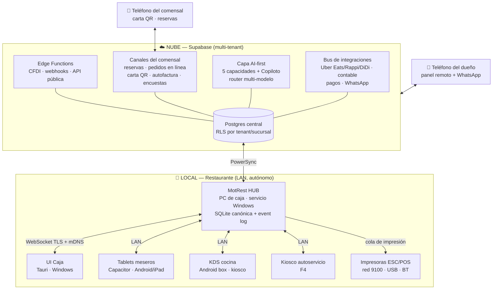
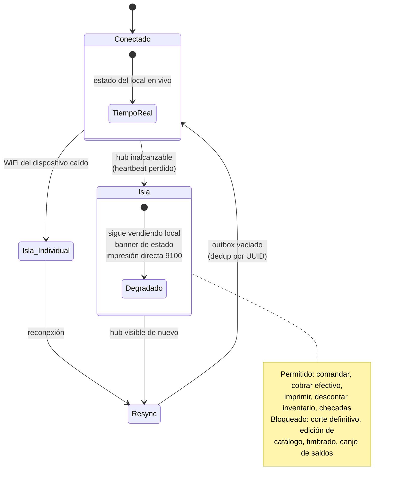
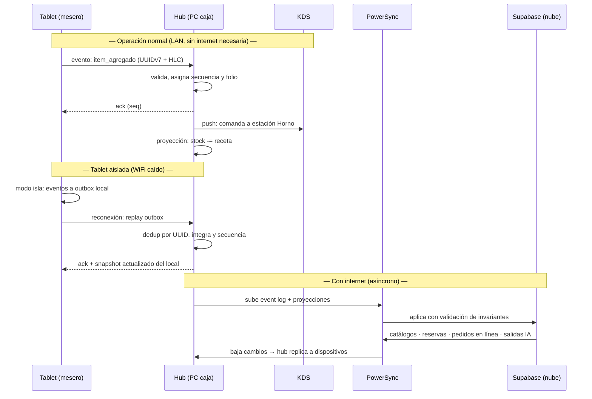
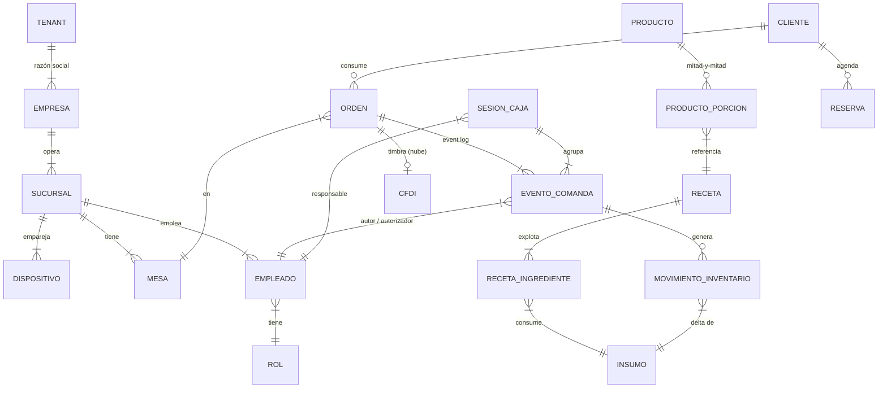
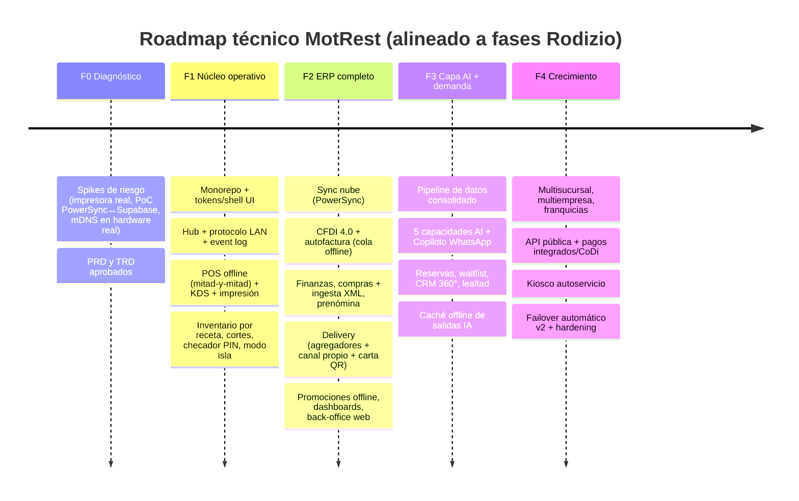

**DOCUMENTO DE PRIMER ORDEN · TÉCNICO**

# MotRest — TRD

**Documento de Requisitos Técnicos (Technical Requirements Document)**

*Arquitectura del ERP restaurantero AI-first de MOTRAE*

**Innovation already in motion**

---

> **Xalapa, Veracruz · México · Julio 2026 | Confidencial**
> MOTRAE · Tecnología y Sistemas · Desarrollo de Software · **MotRest**
> Documento complementario: [`MOTRAE_MotRest_PRD.md`](MOTRAE_MotRest_PRD.md) (requisitos de producto y alcance funcional).

---

## Índice

1. [Propósito](#1-propósito)
2. [Principio rector y requisitos técnicos](#2-principio-rector-y-requisitos-técnicos)
3. [Vista general del sistema](#3-vista-general-del-sistema)
4. [Topología en el local y modo isla](#4-topología-en-el-local-y-modo-isla)
5. [Estrategia offline-first y sincronización](#5-estrategia-offline-first-y-sincronización)
6. [Capa nube](#6-capa-nube)
7. [Capacidades AI-first y degradación offline](#7-capacidades-ai-first-y-degradación-offline)
8. [Stack tecnológico por plataforma](#8-stack-tecnológico-por-plataforma)
9. [Modelo de datos de alto nivel](#9-modelo-de-datos-de-alto-nivel)
10. [Seguridad, roles y auditoría](#10-seguridad-roles-y-auditoría)
11. [Dispositivos: emparejamiento, impresión y actualización](#11-dispositivos-emparejamiento-impresión-y-actualización)
12. [Del design system de los mockups al producto](#12-del-design-system-de-los-mockups-al-producto)
13. [Roadmap técnico F0–F4](#13-roadmap-técnico-f0f4)
14. [Decisiones registradas (ADR) y riesgos abiertos](#14-decisiones-registradas-adr-y-riesgos-abiertos)

---

## 1. Propósito

Este documento define **cómo funciona MotRest por dentro**: la arquitectura que cumple los requisitos del PRD — app instalable en todos los dispositivos del restaurante, conectados entre sí en el local, operando sin internet, construida sobre los renders ya diseñados y cubriendo el estándar funcional del mercado (PRD, Anexo A).

Audiencia: equipo de desarrollo de MOTRAE y colaboradores técnicos. El **qué** y el **para quién** viven en el PRD; aquí vive el **cómo**.

---

## 2. Principio rector y requisitos técnicos

> ### **"LAN-first, nube-después"**
> El restaurante es un sistema autónomo que **nunca deja de vender**; la nube es consolidación, respaldo, multisucursal e inteligencia. Toda decisión de este documento se deriva de este principio.

Requisitos técnicos rectores (trazados a los del CEO en el PRD §3):

| # | Requisito técnico | Origen |
|---|---|---|
| RT1 | Instaladores nativos por plataforma (Windows, Android, iOS) desde **una sola base de código** web | R1 |
| RT2 | Descubrimiento y comunicación **en red local** sin depender de servicios externos | R2 |
| RT3 | Núcleo operativo **100 % funcional sin internet**, incluida la caída parcial de la red interna | R3 |
| RT4 | La UI del producto se construye con la **misma tecnología (HTML/CSS)** y los mismos componentes de los mockups | R4 |
| RT5 | La arquitectura soporta las **99 funciones del Anexo A del PRD**, incluidas las de nube (reservas, delivery, CFDI, IA) con degradación elegante | R5 |
| RT6 | Impresión térmica, cortes arbitrados, auditoría inmutable, multisucursal y multiempresa previstos desde el diseño | R6 |

---

## 3. Vista general del sistema

Tres planos: **la nube** (consolidación, canales del comensal, integraciones, IA), **el hub del local** (cerebro autónomo) y **los dispositivos** (clientes iguales entre sí).

Flujos clave:

- **Venta en el local:** tablet → hub (evento) → KDS + impresora + proyección de stock. Todo por LAN, sin internet.
- **Nube → local:** catálogos, reservas, pedidos en línea, pronósticos y alertas bajan por PowerSync al hub, que los replica a los dispositivos.
- **Local → nube:** el event log y las proyecciones suben cuando hay internet; alimentan finanzas, BI, IA y el panel remoto del dueño.

---

## 4. Topología en el local y modo isla

### 4.1 Hub-and-spoke

**La PC de caja corre el "MotRest Hub"** — un servicio de fondo (no la UI) con la **base de datos canónica del local**. Todos los demás dispositivos —tablets, KDS, iPad/iPhone, kiosco e incluso la propia UI de caja— son **clientes iguales** que hablan con el hub por LAN (WebSocket sobre TLS, descubrimiento por mDNS).

Justificación de dominio: un restaurante necesita **orden total y arbitraje** — folios consecutivos, un solo corte de caja válido, stock que no se descuadre, un solo estado por mesa. El hub da ese punto de secuenciación de forma natural; es además el patrón probado de la industria (estación primaria + terminales). La alternativa P2P/CRDT se descartó (ADR-01): garantiza convergencia de datos pero **no garantiza invariantes de negocio** (no-doble-cobro, folios, cortes) y duplica la complejidad para un equipo pequeño.

### 4.2 Estados de conexión y modo isla

- **Modo isla (v1):** cada dispositivo detecta la caída del hub y sigue operando contra su BD local y su **outbox** de eventos; imprime directo a la impresora de red (puerto 9100) si la alcanza; muestra banner de estado degradado. Al volver el hub, re-sincroniza con deduplicación por UUID. La UI degrada honestamente: no ve las mesas de otros en vivo, sí comanda y cobra las suyas.
- **Failover (v2, fase F4):** el mini-PC/box del KDS (siempre encendido y cableado) corre una **réplica pasiva del hub** que se promueve tras N segundos sin líder, por lista de prioridad fija definida en el emparejamiento — no un consenso genérico. Botón manual del gerente: "promover este dispositivo a hub de emergencia".

### 4.3 Operaciones por estado

| Operación | Conectado | Isla | Nota |
|---|---|---|---|
| Comandar, enviar a cocina, mitad-y-mitad con costeo | ✅ | ✅ | Catálogo local |
| Cobrar efectivo, dividir cuenta, propinas | ✅ | ✅ | Eventos aditivos |
| Imprimir comanda/ticket | ✅ | ✅ (directo 9100) | Cola en hub o directo |
| Descuento de inventario por receta | ✅ | ✅ | Deltas, se consolidan |
| Checadas de personal | ✅ | ✅ | |
| Pre-corte (borrador) | ✅ | ✅ | |
| **Corte de caja definitivo** | ✅ | ❌ | Lo sella el hub |
| **Edición de catálogo/precios** | ✅ | ❌ | Gerencia, online |
| **Timbrado CFDI** | ✅ (con internet) | ❌ (cola) | Ticket sale siempre |
| **Canje de puntos / saldo monedero** | ✅ | ❌ | Saldo arbitrado |

---

## 5. Estrategia offline-first y sincronización

### 5.1 Patrón dual según naturaleza del dato

| Tipo de dato | Patrón | Conflictos |
|---|---|---|
| **Operacional** (comandas, pagos, movimientos de inventario, checadas, mermas, trabajos de impresión) | **Event sourcing**: log append-only; cada evento lleva UUIDv7 + reloj lógico híbrido (HLC) + device_id; el hub asigna secuencia total y folios legibles | No hay conflicto por diseño: los eventos son aditivos |
| **Catálogos** (productos, recetas, precios, empleados, mesas, proveedores, reglas de promociones) | **CRUD con LWW** por fila (updated_at + versión); se editan casi siempre online por gerencia | Raros; gana el último con bitácora del valor pisado |
| **Sellados** (corte de caja, cierre de periodo, CFDI, saldos de lealtad) | Solo con **arbitraje** del hub (corte) o la nube (timbrado, cierre, saldos) | Prohibidos en modo isla; existe "pre-corte" borrador |

Resolución de conflictos realista del dominio:

- **Comandas:** `item_agregado`, `item_cancelado{autorizador}`, `enviado_a_cocina`, `pago_registrado`, `cuenta_cerrada` son eventos; dos meseros sobre la misma mesa simplemente agregan eventos a la misma cuenta. Cancelar exige PIN de un rol autorizante (verificable offline) y queda auditado.
- **Inventario:** el stock es **suma de movimientos** (deltas), nunca un campo sobrescrito → dos descuentos simultáneos no chocan. El stock negativo **se señala** (alerta al Centinela), no bloquea la venta.
- **Cortes:** el corte es un snapshot que el hub sella con su secuencia; eventos rezagados posteriores al sello caen al turno siguiente con marca "extemporáneo" — así funciona la contabilidad real de un restaurante.

### 5.2 Sincronización en dos niveles (decisión estructural)

1. **Dispositivo ↔ Hub — protocolo LAN propio y delgado:** replicación del event log con números de secuencia por dispositivo + snapshots versionados de catálogo (append + ack + snapshot). Se descartó que cada tablet sincronice directo con la nube: si cayera internet, los dispositivos dejarían de verse **entre sí**, violando R2 y R3. Este protocolo es pequeño y es el corazón defendible del producto.
2. **Hub ↔ Nube — PowerSync:** el hub es el **único cliente PowerSync por local**. Baja catálogos, configuración, reservas, pedidos en línea y salidas de IA; sube el event log y proyecciones.

### 5.3 Almacenamiento local

- **Hub:** SQLite canónica (WAL) — event log + catálogos + proyecciones.
- **Dispositivos:** SQLite con dos zonas: **réplica de lectura** (catálogos + estado del local, alimentada por el hub) y **outbox** (eventos propios pendientes de ack). Cifrado en móviles (SQLCipher).
- **Retención:** los dispositivos podan su event log tras ack + N días; el hub conserva el histórico del periodo fiscal; la nube conserva todo.

---

## 6. Capa nube

**Backend: Supabase** (Postgres multi-tenant con RLS por `tenant/empresa/sucursal`, Auth, Storage, Edge Functions). **Motor de sync: PowerSync** (integración oficial con Supabase, SDK Node para el hub, sync rules por sucursal/rol, cola de escritura validable en servidor). Alternativas descartadas en ADR-03/04.

| Componente nube | Responsabilidad |
|---|---|
| **Postgres central** | Consolidado multi-local; fuente para BI (M8), finanzas (M5) y la capa AI |
| **Canales del comensal** | Web pública multi-tenant: reservas omnicanal + waitlist + no-shows, pedidos en línea propio, carta QR, autofactura CFDI, encuestas. Sus eventos bajan al hub por sync |
| **Bus de integraciones** | Webhooks de agregadores (Uber Eats/Rappi/DiDi) → cola → hub (la comanda entra al KDS como cualquier otra); exportación contable (CONTPAQi/Aspel/Microsip); pagos integrados (Clip/CoDi/wallets); WhatsApp (alertas M8 + Copiloto) |
| **Servicio fiscal** | Timbrado CFDI 4.0 vía PAC, cancelaciones, complementos, resguardo de certificados y folios; **cola de "pendiente de timbrado"** para ventas offline (el ticket sale al momento; el plazo legal permite timbrar al reconectar) |
| **API pública** | Los endpoints internos se diseñan publicables desde F2; documentación pública en F4 |
| **Panel remoto del dueño** | La misma app en modo remoto, leyendo la nube, con **sello de frescura de datos** |
| **Respaldo** | La nube es respaldo primario tras sync + snapshot nocturno local del SQLite del hub a disco/USB + PITR de Supabase |

**Multisucursal (F4):** un hub por sucursal; catálogo maestro con overrides por sucursal; las sync rules bajan a cada hub solo lo suyo; la nube consolida. **Multiempresa:** jerarquía `tenant → empresa (razón social) → sucursal` en el modelo de datos **desde F1**, aunque la UI corporativa llegue en F4.

---

## 7. Capacidades AI-first y degradación offline

Las cinco capacidades (PRD §5) corren **en la nube** (capas 03 Inteligencia y 04 Orquestación de la plataforma MOTRAE: router multi-modelo Claude/GPT/Gemini + orquestador de sub-agentes con traza completa), como jobs y agentes sobre el Postgres consolidado.

| Capacidad | Cómputo | Salida sincronizada al local (visible offline, con fecha) |
|---|---|---|
| C1 Gemelo digital / simulador | Nube (bajo demanda) | Resultados de simulación cacheados |
| C2 Menu engineering + precios | Nube (job periódico) | Matriz estrella/vaca/enigma/perro + recomendaciones |
| C3 Pronóstico + compras/turnos autónomos | Nube (job diario) | Pronóstico de demanda, OC sugeridas, turnos sugeridos |
| C4 Voz del Cliente | Nube (ingesta continua) | Resumen de sentimiento por platillo/turno/estación |
| C5 Centinela de mermas | Nube (streaming sobre el event log subido) | Alertas priorizadas por severidad |
| Copiloto del Dueño | Nube pura (chat/voz/WhatsApp) | — (requiere internet; respeta jerarquía M9) |

**Regla de oro:** la IA **recomienda y alerta**; nunca es requisito para operar. Sin internet, el local ve la última salida sincronizada con su fecha ("Pronóstico del 12-jul") y sigue vendiendo.

---

## 8. Stack tecnológico por plataforma

| Pieza | Decisión | Alternativas descartadas |
|---|---|---|
| **UI** | **Svelte 5 + TypeScript** (SPA, Vite). Los mockups HTML/CSS se portan casi 1:1 a componentes con estilos scoped; runtime mínimo (clave para Android boxes económicas); reactividad ideal para KDS/mesas en vivo | React (traducción más costosa, runtime mayor) · Vue (sin ventaja clara) · vanilla+Lit (lento para un ERP de 9 módulos) |
| **Windows (caja)** | **Tauri 2**: instalador firmado, auto-update, WebView2, acceso USB, footprint mínimo | Electron (≈10× el peso sin beneficio) |
| **Android / iOS / Android box** | **Capacitor 6**: plugins maduros (SQLite, Bluetooth, mDNS/zeroconf, kiosk/lock-task); el KDS es un APK en modo kiosco | Tauri 2 mobile (ecosistema de plugins móviles aún delgado) · apps nativas por plataforma (rompe R4 y duplica equipos) |
| **Abstracción de plataforma** | Interfaz **`PlatformBridge`** (impresión, SQLite, mDNS, cámara/QR) con implementación Tauri y Capacitor; el resto del código es único | — |
| **Hub (backend local)** | **Node.js + TypeScript como servicio de Windows** (Fastify + WebSocket, better-sqlite3, SDK PowerSync), empaquetado como binario; arranca con la PC y sobrevive al cierre de la UI — la UI de caja es un cliente más | Sidecar Rust (parte el codebase en dos lenguajes) · Go (mismo argumento) |
| **Impresión ESC/POS** | Servicio de impresión **en el hub** con cola, reintentos y ruteo por área (cocina/barra/caja): red 9100 (preferida), USB (node-usb en caja), Bluetooth (plugin Capacitor para impresoras de mesero); plantillas: comanda, ticket, pre-cuenta, corte. Fallback en isla: dispositivo → impresora 9100 directo | Imprimir desde cada cliente (pesadilla de drivers y duplicados) |
| **Monorepo** | pnpm workspaces: `apps/pos-ui` (Svelte) · `apps/hub` (Node) · `packages/dominio` (tipos + reducers de eventos compartidos hub/cliente) · `packages/ui` (design system) · `packages/protocolo-sync` · `packages/impresion` | — |

---

## 9. Modelo de datos de alto nivel

| Grupo | Entidades | Patrón de sync |
|---|---|---|
| **Catálogos** | producto, categoría, receta (+receta_ingrediente), insumo, grupo_modificadores, lista_precios, regla_promoción, mesa/área, estación_kds, impresora, empleado (+PIN hash), rol/permiso, proveedor, sucursal, empresa, dispositivo | CRUD/LWW; bajan de nube al hub y del hub a dispositivos |
| **Operacionales** | evento_comanda (orden_creada, item_agregado{config mitades, notas}, item_cancelado{autorizador}, enviado_a_cocina, item_listo, cuenta_dividida/unida, pago_registrado{método}, cuenta_cerrada) · movimiento_inventario (consumo por receta al enviar a cocina, recepción, merma, ajuste de conteo) · checada · sesion_caja (apertura, retiros, corte) · print_job | Event sourcing (UUIDv7 + HLC); folio legible lo asigna el hub al ack |
| **Proyecciones** (derivadas, recomputables) | stock actual, estado de mesas, ventas del día, food cost | Vistas en el hub; replicadas y enriquecidas en Postgres para M8 |
| **Solo-nube** | cfdi (timbres, UUID fiscal, cola), reserva, pedido_en_línea, pronóstico, sugerencia_compra/turno, alerta_centinela, resena_voc, campaña_crm, saldo_lealtad/monedero/gift_card, nómina | Viven en Postgres; el local recibe lo que necesita ver |

**Mitad-y-mitad (exigencia Rodizio):** un producto configurable guarda `porciones: [{receta_id, fraccion}]` + base compartida (masa/salsa se costean una vez; toppings al 50 % por mitad). El renglón de comanda guarda **snapshot de costo y precio** al momento — el costeo en vivo del mockup P1 se calcula del catálogo local y **funciona offline**. Extensible a tercios y pastas a elección.

---

## 10. Seguridad, roles y auditoría

- **Autenticación local:** PIN por empleado (hash argon2 en el hub, caché cifrado en dispositivo para modo isla); cambio rápido de usuario en POS. Identidad de dispositivo por **certificado emitido en el emparejamiento**.
- **Autenticación nube:** Supabase Auth (email + MFA para dueño/administración/contabilidad); el hub obtiene JWT para PowerSync; **RLS por tenant/empresa/sucursal/rol** en todo acceso remoto.
- **Autorización:** matriz rol × acción (jerarquía de visión y administración, PRD §2) **aplicada en el hub** — nunca se confía en el cliente — y espejada en RLS. Acciones sensibles (cancelación, cortesía, descuento fuera de límite) exigen PIN de un rol autorizante, verificable offline.
- **Auditoría:** el event log **es** la bitácora inmutable (quién, qué, en qué dispositivo, autorizado por quién, HLC). Es exactamente el insumo del Centinela (C5) y del módulo M9 — auditoría y prevención de pérdidas comparten sustrato.
- **Cifrado:** WebSocket LAN sobre TLS con certificado del hub **pineado vía QR de emparejamiento**; SQLCipher en móviles; secretos en keystore/keychain por plataforma; **nada de llaves en el repositorio** (convención MOTRAE).

---

## 11. Dispositivos: emparejamiento, impresión y actualización

### Descubrimiento y emparejamiento

1. El hub anuncia `_motrest._tcp.local` por **mDNS** (nombre de sucursal, versión, fingerprint TLS). Fallback: IP manual.
2. Alta de dispositivo: el hub muestra un **QR** `{IP, puerto, fingerprint, token de un solo uso}`; el dispositivo lo escanea y recibe una credencial de larga vida.
3. El gerente aprueba y asigna el **perfil** en M9: caja, POS móvil, KDS (con estación), kiosco.

### Impresión térmica ESC/POS

Centralizada en el hub: cola con reintentos y ruteo por área. Transportes: **red 9100** (cocina/caja, preferido), **USB** (caja), **Bluetooth** (impresoras portátiles de mesero). Codificación con plantillas versionadas (comanda por estación, ticket, pre-cuenta, corte). En modo isla el dispositivo imprime directo a 9100.

### Actualización

| Plataforma | Mecanismo |
|---|---|
| Windows (hub + caja) | Tauri Updater firmado contra Supabase Storage; canales estable/beta |
| Android (tablets, KDS, kiosco) | APK gestionado con self-update (o Play privado) |
| iOS (iPad/iPhone) | App Store / TestFlight |
| Assets web (fixes de UI) | Actualización caliente (Capgo) solo para parches menores |

**Regla de compatibilidad:** el hub declara la **versión mínima de protocolo**; un cliente desactualizado entra en **solo-lectura** hasta actualizar. Las migraciones de esquema SQLite están versionadas y las aplica el hub antes de aceptar clientes.

---

## 12. Del design system de los mockups al producto

Los 7 mockups de `entregables/claude_design_motrest/producto/` definen el design system implícito. Plan de conversión:

1. **Design tokens** → `packages/ui/tokens.css`, renombrando semántica (el mockup dice `--verde` pero contiene naranja por el rebrand): `--acento: #F2853A` · `--acento-tinte: #FDEBD7` · `--advertencia: #E6B23A` · `--critico: #E0392B` · `--tinta: #2D3A42` · `--negro: #14181A` · superficie oscura KDS (`--panel: #1C2226`, `--linea: #2A3237`) · radios 9–20 px · sombras. **Fuentes empaquetadas localmente** (Space Grotesk + Inter): los mockups usan Google Fonts CDN y eso **rompe offline** (RT3).
2. **Componentes desde las clases de los mockups:** `.sb` → `<SidebarModulos>` · `.hd`/`.chip`/`.avatar` → `<HeaderShell>` (sucursal + rol) · `.mesa` → `<MesaTile>` · `.tk` → `<TicketKDS>` (estados normal/advertencia/demorado/listo ya definidos en P2) · `.b1`/`.b2` → `<Boton variante>` · `.live` → `<BarraCosteoVivo>` · `.pz` → `<ConfiguradorMitades>`. Los datos demo de los mockups se conservan como **fixtures** para comparación visual lado a lado (Storybook/Histoire).
3. **Responsive:** los mockups son lienzo fijo 1920×1080 con tipografía inflada (~27 px). El producto re-basa a `rem` (~15 px cuerpo) manteniendo proporciones, con **perfiles de densidad**: `escritorio` (≥1280 px: POS a 3 columnas como P1), `tablet` (768–1279: salón colapsa a drawer, cuenta como panel deslizable), `teléfono` (<768: flujo por pasos, patrón del P6). El **KDS conserva tamaños grandes** (lectura a distancia) como perfil propio.

---

## 13. Roadmap técnico F0–F4

Detalle por fase en PRD §8 (con cobertura del estándar del benchmark por categoría).

---

## 14. Decisiones registradas (ADR) y riesgos abiertos

### Decisiones (resumen ADR)

| # | Decisión | Alternativa descartada | Motivo |
|---|---|---|---|
| ADR-01 | Topología hub-and-spoke con modo isla | P2P/mesh con CRDT (cr-sqlite) | Los CRDT convergen datos pero no garantizan invariantes de negocio (folios, cortes, no-doble-cobro); complejidad excesiva |
| ADR-02 | Event sourcing para lo operacional + CRUD/LWW para catálogos | Todo CRUD o todo eventos | Cada patrón donde su naturaleza lo pide; eventos aditivos eliminan conflictos de comandas e inventario |
| ADR-03 | Supabase como backend cloud | Backend propio en VPS | Costo de operación sin valor diferencial hoy; MOTRAE ya lo opera |
| ADR-04 | PowerSync como motor hub↔nube | ElectricSQL (escrituras "hazlo tú", API móvil) · Turso embedded replicas (escritor único en nube) · CR-SQLite (sin servicio gestionado) | Integración oficial Supabase + SDK Node + sync rules + cola de escritura validable |
| ADR-05 | Sync en dos niveles: protocolo LAN propio + PowerSync solo en el hub | Cada dispositivo sincroniza directo con nube | Si cae internet los dispositivos dejarían de verse entre sí (viola R2/R3) |
| ADR-06 | Svelte 5 + Tauri 2 + Capacitor 6, una sola base de código | React/Vue/Lit · Electron · apps nativas | Portado casi 1:1 de los mockups, footprint mínimo, ecosistema móvil maduro |
| ADR-07 | Hub en Node.js/TypeScript como servicio de Windows | Sidecar Rust · Go | Un solo lenguaje en todo el producto; equipo TS-first |
| ADR-08 | Impresión centralizada en el hub con fallback directo en isla | Impresión desde cada cliente | Cola única, sin duplicados ni infierno de drivers |
| ADR-09 | Marketplace de comensales y funciones de red = visión post-F4 | Construirlas en v1 | Requieren masa crítica de restaurantes; se registran en el Anexo A del PRD, no se omiten |
| ADR-10 | Acento de marca del producto: naranja `#F2853A` | Verde `#57AD30` del README §12 | Decisión de Gonzalo (2026-07-03) registrada en el bundle de diseño; README maestro pendiente de actualizar |

### Riesgos abiertos

| Riesgo | Mitigación planeada |
|---|---|
| Madurez de plugins mDNS/Bluetooth de Capacitor en hardware real | Spike en F0 con las tablets e impresora reales de Rodizio |
| Costos de PowerSync Cloud vs. self-host a escala | Medir en F2 con datos reales; PowerSync es self-hosteable |
| Elección de PAC para CFDI (Facturama / SW Sapien / Finkok) | Decidir en F2 con comparativa de costos por timbre y SLA |
| Política de retención del event log en dispositivos de poca memoria | Poda tras ack + N días; medir en F1 |
| Failover v1 depende de disciplina operativa (PC de caja encendida) | UPS recomendado en hardware de caja; failover automático en F4 |
| Google Fonts en mockups rompe offline si se copia tal cual | Empaquetar fuentes en `packages/ui` desde el primer commit de F1 |

---

**MOTRAE** · *Innovation already in motion*
TRD · MotRest · Confidencial · Julio 2026 · Xalapa, Veracruz · México

